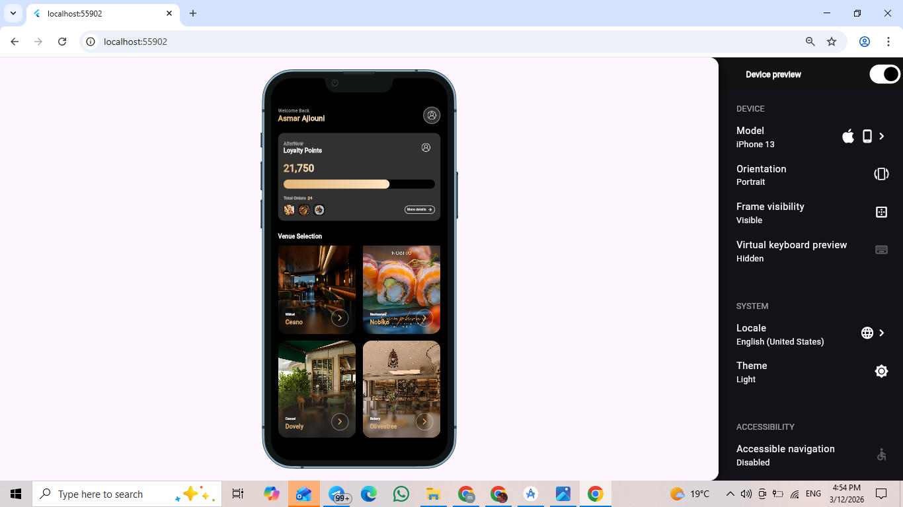
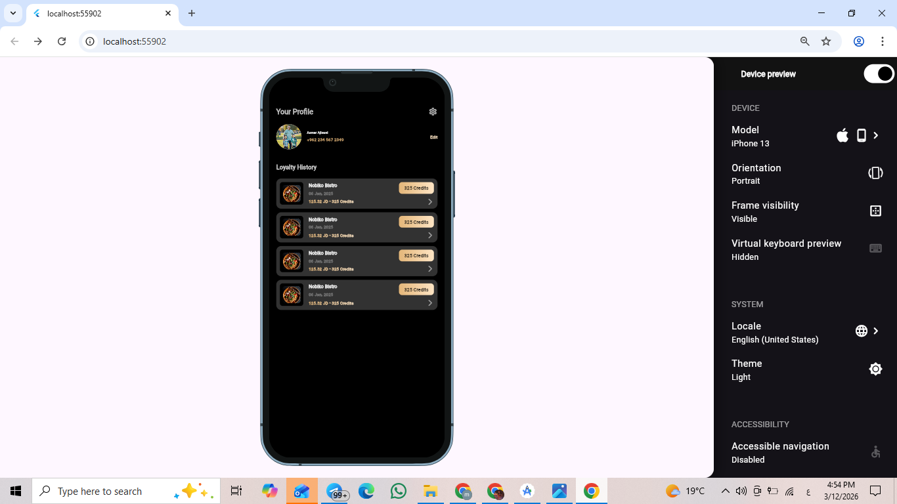

# Technical Assessment – Flutter App

## Overview

This project is a **Flutter technical assessment** that demonstrates the implementation of high-fidelity UI designs using clean and structured Flutter code.
The application focuses on building responsive UI components while maintaining **clean architecture, reusable widgets, and organized project structure**.

The app includes two main screens:

* **Home Screen**
* **Profile Screen**

The implementation follows best practices such as:

* Reusable widgets
* Feature-based folder structure
* Consistent design system
* Responsive layout
* Clean and readable code

---

# Features

### Home Screen

* Welcome header with user name
* Loyalty card showing user points
* Venue selection grid
* Responsive grid layout for different screen sizes

### Profile Screen

* User profile information
* Edit profile option
* Loyalty history list
* History cards showing previous transactions

---

# Project Structure

```
lib
│
├── core
│   ├── styles
│   │   └── app_texts.dart
│   │
│   └── utils
│       ├── app_colors.dart
│       ├── app_fonts.dart
│       ├── app_icons.dart
│       └── app_images.dart
│
├── data
│   └── dummy_data.dart
│
├── model
│   ├── loyalty_model.dart
│   └── venue_model.dart
│
├── presentation
│   ├── screens
│       ├── home
│       │   ├── home_screen.dart
│       │   └── widgets
│       │
│       └── profile
│           ├── profile_screen.dart
│           └── widgets
│   
│   
│
└── main.dart
```

This structure helps maintain **scalability, readability, and separation of concerns**.

---

# Design Implementation

The UI was implemented based on provided **Figma designs** with focus on:

* Pixel-perfect layout
* Gradient effects
* Blur overlays
* Custom typography
* Reusable UI components

---

# Packages Used

```
device_preview
```

Used to preview the application across multiple screen sizes during development.

---

# Running the Project

### 1. Clone the repository

```
git clone <repo-link>
```

### 2. Install dependencies

```
flutter pub get
```

### 3. Run the project

```
flutter run
```

---

# Responsive Design

The layout adapts to different screen sizes using:

* `LayoutBuilder`
* Flexible UI components
* Grid layout adjustments

---

# Screenshots

### Home Screen


### Profile Screen


> Replace the image paths with your actual screenshots.

---

# Notes

* The project focuses on **UI implementation and clean code practices**.
* Dummy data is used to simulate real application data.
* Components are separated into reusable widgets to improve maintainability.

---

# Author

**Amira Ezzat**
Flutter Developer
